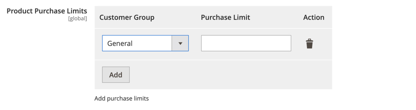

# Dynamic Rows in Store Configurations

Create a store configuration that helps to specify max purchase limit per customer group 



## Kata Solution

TBU

`etc/adminhtml/system.xml`:

```xml
<?xml version="1.0"?>
<!-- MageKata: Dynamic Rows in Store Configurations -->
<config xmlns:xsi="http://www.w3.org/2001/XMLSchema-instance" xsi:noNamespaceSchemaLocation="urn:magento:module:Magento_Config:etc/system_file.xsd">
    <system>
        <section id="catalog">
            <group id="frontend">
                <field id="product_purchase_limits" translate="label" sortOrder="320" showInDefault="1" showInWebsite="0" showInStore="0" canRestore="1">
                    <label>Product Purchase Limits</label>
                    <frontend_model>Glushko\MageKata\Block\Config\ProductPurchaseLimit\PurchaseLimitConfig</frontend_model>
                    <backend_model>Magento\Config\Model\Config\Backend\Serialized\ArraySerialized</backend_model>
                    <comment>Add purchase limits</comment>
                </field>
            </group>
        </section>
    </system>
</config>
```

`Block/Config/ProductPurchaseLimit/PurchaseLimitConfig.php`:

```php
<?php

declare(strict_types=1);

namespace Glushko\MageKata\Block\Config\ProductPurchaseLimit;

use Magento\Config\Block\System\Config\Form\Field\FieldArray\AbstractFieldArray;
use Magento\Framework\DataObject;
use Magento\Framework\Exception\LocalizedException;

/**
 * System Config Field for Dynamic Options Group
 */
class PurchaseLimitConfig extends AbstractFieldArray
{
    /**
     * @var CustomerGroupField
     */
    private $customerGroupRenderer;

    /**
     * @inheritDoc
     */
    protected function _prepareToRender()
    {
        $this->addColumn(
            'customer_group_id',
            [
                'label' => __('Customer Group'),
                'renderer' => $this->getCustomerGroupRenderer(),
            ]
        );

        $this->addColumn(
            'purchase_limit',
            [
                'label' => __('Purchase Limit'),
                'class' => 'required-entry validate-number',
            ]
        );

        $this->_addAfter = false;

        $this->_addButtonLabel = __('Add');
    }

    /**
     * @return CustomerGroupField
     * @throws LocalizedException
     */
    private function getCustomerGroupRenderer(): CustomerGroupField
    {
        if ($this->customerGroupRenderer) {
            return $this->customerGroupRenderer;
        }

        /** @var CustomerGroupField $customerGroupRenderer */
        $customerGroupRenderer = $this->getLayout()->createBlock(
            CustomerGroupField::class,
            '',
            [
                'data' => [
                    'is_render_to_js_template' => true
                ]
            ]
        );
        $customerGroupRenderer->setClass('customer_group_select');

        $this->customerGroupRenderer = $customerGroupRenderer;

        return $this->customerGroupRenderer;
    }

    /**
     * @param DataObject $row
     * @return void
     */
    protected function _prepareArrayRow(DataObject $row): void
    {
        $optionExtraAttr = [];
        $customerGroupId = $row->getData('customer_group_id');
        $optionHash = $this->getCustomerGroupRenderer()->calcOptionHash($customerGroupId);

        $optionExtraAttr['option_' . $optionHash] = 'selected="selected"';

        $row->setData(
            'option_extra_attrs',
            $optionExtraAttr
        );
    }
}
```

`Block/Config/ProductPurchaseLimit/CustomerGroupField.php`:

```php
<?php

declare(strict_types=1);

namespace Glushko\MageKata\Block\Config\ProductPurchaseLimit;

use Magento\Customer\Api\GroupManagementInterface;
use Magento\Customer\Api\GroupRepositoryInterface;
use Magento\Framework\Api\SearchCriteriaBuilder;
use Magento\Framework\Exception\LocalizedException;
use Magento\Framework\View\Element\Context as TemplateContext;
use Magento\Framework\View\Element\Html\Select as SelectRenderer;

/**
 * HTML select element block with customer groups options
 */
class CustomerGroupField extends SelectRenderer
{
    /**
     * @var GroupRepositoryInterface
     */
    protected $groupRepository;

    /**
     * @var SearchCriteriaBuilder
     */
    protected $searchCriteriaBuilder;

    /**
     * @var GroupManagementInterface
     */
    protected $groupManagement;

    /**
     * @param TemplateContext $context
     * @param GroupRepositoryInterface $groupRepository
     * @param GroupManagementInterface $groupManagement
     * @param SearchCriteriaBuilder $searchCriteriaBuilder
     * @param array $data
     */
    public function __construct(
        TemplateContext $context,
        GroupRepositoryInterface $groupRepository,
        GroupManagementInterface $groupManagement,
        SearchCriteriaBuilder $searchCriteriaBuilder,
        array $data = []
    ) {
        parent::__construct($context, $data);

        $this->groupRepository = $groupRepository;
        $this->searchCriteriaBuilder = $searchCriteriaBuilder;
        $this->groupManagement = $groupManagement;
    }

    /**
     * @return array
     * @throws LocalizedException
     */
    private function getCustomerGroups(): array
    {
        $customerGroupOptions = [];
        $searchCriteria = $this->searchCriteriaBuilder->create();
        $customerGroupSearchResult = $this->groupRepository->getList($searchCriteria);

        foreach ($customerGroupSearchResult->getItems() as $item) {
            $customerGroupOptions[$item->getId()] = $item->getCode();
        }

        $notLoggedInGroup = $this->groupManagement->getNotLoggedInGroup();
        $customerGroupOptions[$notLoggedInGroup->getId()] = $notLoggedInGroup->getCode();

        return $customerGroupOptions;
    }

    /**
     * @param string $value
     * @return $this
     */
    public function setInputName($value)
    {
        return $this->setName($value);
    }

    /**
     * Render block HTML
     *
     * @return string
     */
    public function _toHtml()
    {
        if (!$this->getOptions()) {
            foreach ($this->getCustomerGroups() as $groupId => $groupLabel) {
                $this->addOption($groupId, addslashes($groupLabel));
            }
        }

        return parent::_toHtml();
    }
}
```
